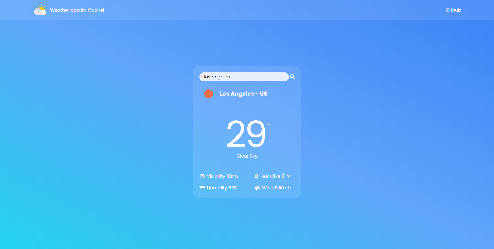

# WEATHER APP

This is a weather weather application, the user enters the city in which he wants to search and information such as:

- Temperature in celsius
- Description of how is the sky
- Visibility
- Temperature feels like
- Humidity
- Wind speed

### Build with

This applications has build with:

- HTML
- TailwindCSS
- Javascript

### Screenshot

### Links

- Live site [https://gbmoura-weather-app.netlify.app/](https://gbmoura-weather-app.netlify.app/)
- Linkedin [Gabriel Moura](https://www.linkedin.com/in/gabriel-moura-b63382161/)
- Frontend Mentor [@gbmouraa](https://www.frontendmentor.io/profile/gbmouraa)